# 🐬 Mobipper – Lecteur de cartes MOBIB pour Flipper Zero

<p align="center">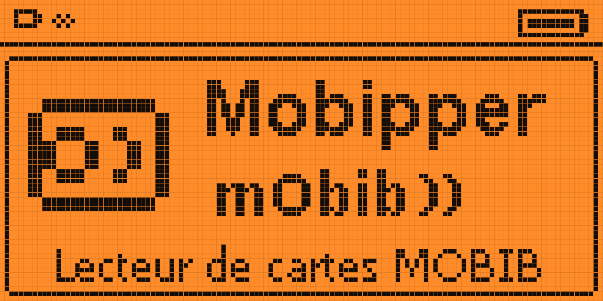</p>

[](https://github.com/Th3rdMan/Mobipper/releases/latest)
[](https://github.com/Th3rdMan/Mobipper/actions/workflows/build.yml)


[](https://github.com/Th3rdMan)
[](https://github.com/i12bp8/flipper-mobib)


**Mobipper** (MOBIB + Flipper) est une application [Flipper Zero](https://flipperzero.one/) qui lit et décode les cartes de transport belges **MOBIB** — la carte sans contact Calypso / ISO 14443-B partagée par la **STIB/MIVB**, la **SNCB/NMBS**, **De Lijn** et le **TEC**.  
Il suffit de poser la carte contre le dos du Flipper : l'application lit tous les fichiers accessibles, décode les informations utiles (titulaire, abonnements, derniers trajets) et sauvegarde la lecture sur la carte SD.

> 🙏 **Mobipper n'existerait pas sans [flipper-mobib](https://github.com/i12bp8/flipper-mobib) de [i12bp8](https://github.com/i12bp8).**  
> Tout le cœur technique vient de son travail : le dialogue NFC avec la carte (ISO 14443-B / Calypso), la lecture complète des fichiers, les décodeurs des champs MOBIB et la sauvegarde sur SD.  
> Mobipper n'en est qu'une adaptation : traduction en français, réorganisation de l'interface et quelques enrichissements.

<p align="center">
  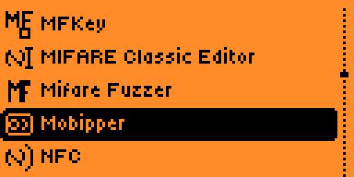
  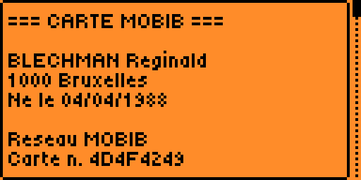
</p>

---

## 📍 Zone d'utilisation

La carte **MOBIB** est la carte de transport de la **Belgique** : elle n'intéressera que les utilisateurs de ces réseaux.

| Opérateur | Zone | Prise en charge par Mobipper |
|-----------|------|------------------------------|
| **STIB / MIVB** | Bruxelles-Capitale (métro, tram, bus) | ✅ complète : noms des arrêts et des stations, lignes |
| **SNCB / NMBS** | Trains, toute la Belgique | ⚠️ lecture de la carte ; trajets sans nom de gare (non testé) |
| **De Lijn** | Flandre (tram, bus) | ⚠️ lecture de la carte ; trajets sans nom d'arrêt (non testé) |
| **TEC** | Wallonie (bus, tram de Charleroi) | ⚠️ lecture de la carte ; trajets sans nom d'arrêt (non testé) |

La table des arrêts est issue du réseau **STIB** : en dehors de Bruxelles, les trajets s'affichent au mieux avec la ligne et le numéro d'arrêt, sans nom. Seules des cartes utilisées à Bruxelles ont été testées.

---

## 📸 Démonstration

Captures prises sur un Flipper Zero, avec une carte **fictive** (titulaire, commune, date de naissance, numéro de carte et trajets inventés — *BLECHMAN Reginald*).

<p align="center">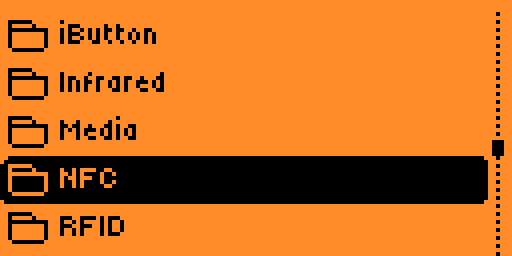</p>

| | | |
|:---:|:---:|:---:|
| 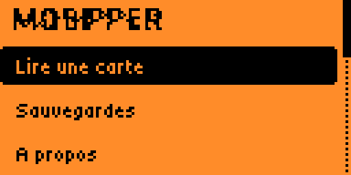<br>Menu principal | <br>Lecture d'une carte | <br>Sauvegardes |
| <br>Résumé (titulaire) | 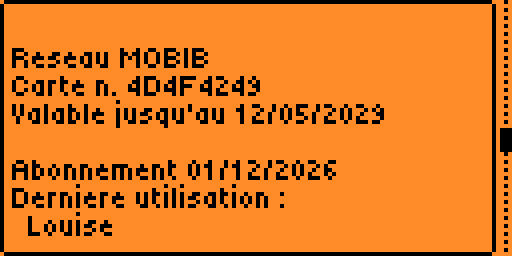<br>Résumé (carte, abonnement) | 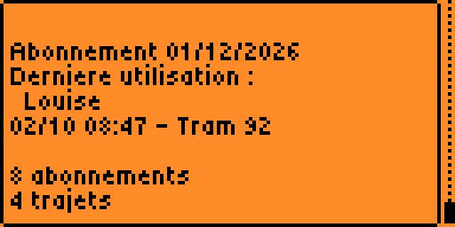<br>Résumé (dernière utilisation) |
| 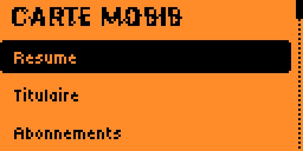<br>Menu de la carte | 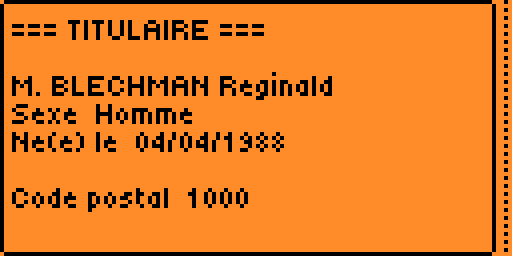<br>Titulaire | 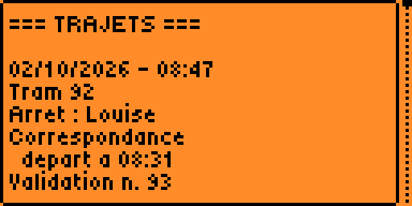<br>Trajets (tram + correspondance) |
| 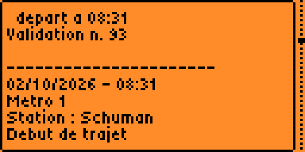<br>Trajets (métro) | 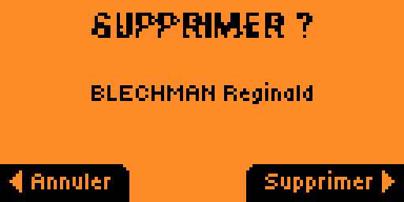<br>Suppression d'une sauvegarde | 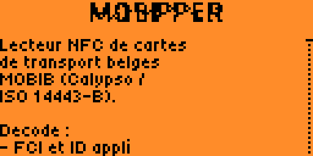<br>A propos |

---

## 🔍 Fonctionnalités

- 🇫🇷 **Interface entièrement en français**  
  Menus, écrans de lecture, sections de la carte, messages et écran « A propos ».  
  Dates au format `JJ/MM/AAAA`, prix en `EUR`. Les polices du Flipper étant limitées à l'ASCII, les textes sont écrits sans accents.

- 📋 **Résumé affiché dès la lecture**  
  Après un scan, l'essentiel apparaît immédiatement, sans passer par les menus :  
  titulaire, commune, date de naissance, validité de la carte, fin de l'abonnement en cours, voyages restants, dernière utilisation.

- 🎟️ **Voyages restants**  
  Pour les titres à voyages (Jump 1 / 10 voyages), le nombre de voyages restants est lu dans les compteurs de la carte. Il apparaît dans « Abonnements » et, s'il en reste, dans le résumé.

- 📮 **Code postal → commune**  
  Le code postal du titulaire est traduit en nom de commune (`1090 Jette`) grâce à une base de **1187 codes postaux belges** (bpost).  
  La base est livrée comme fichier d'assets (`files/postal_codes.txt`) : installée sur la carte SD au premier lancement, elle ne consomme pas de RAM.

- 💾 **Une sauvegarde par carte, nommée `NOM Prenom`**  
  Chaque lecture est enregistrée dans `/ext/apps_data/mobipper/dumps/` sous le nom du titulaire (`DUPONT Jean.mobibdump`).  
  Rescanner la même carte **met à jour** sa sauvegarde (reconnaissance par numéro de carte) ; une autre carte au même nom reçoit un suffixe (`DUPONT Jean 2`).  
  Les cartes anonymes gardent le format `<PUPI>_<date>`.

- 🗑️ **Suppression des sauvegardes**  
  Depuis le menu de la carte, avec écran de confirmation. Retour automatique à la liste des sauvegardes.

- 🧊 **Plus de blocage sur « Sauvegardes »**  
  La liste des fichiers et la confirmation sont intégrées à l'application au lieu de passer par le service Dialogs du système.  
  Ce service ne gère qu'une liste à la fois : quand le menu Apps ou l'Archive l'occupait, l'application restait figée sur un écran vide.

- 🚌 **Trajets lisibles**  
  Chaque validation est présentée clairement :

  | Ligne | Exemple |
  |-------|---------|
  | Date - heure | `02/10/2026 - 17:26` |
  | Mode + ligne | `Bus 71`, `Tram 92`, `Metro 2` |
  | Lieu | `Arret : Flagey` / `Station : Simonis` |
  | Correspondance | `depart a 16:32` (heure de la première validation du trajet) |

- 🗺️ **Arrêts STIB à jour (2026)**  
  Table régénérée depuis le GTFS officiel STIB-MIVB : **72 lignes** (bus, tram, métro) et **3405 arrêts**, contre 49 lignes de bus en 2009.  
  Le script [`tools/gtfs_stops.py`](tools/gtfs_stops.py) permet de la régénérer à tout moment.  
  Côté métro, la table de 2009 est complétée (Elisabeth, second code de Gare du Midi) et les lignes portent leur numéro actuel (1, 2, 5, 6).

- 🎫 **Abonnements corrigés**  
  L'unité de durée utilisée par les cartes actuelles est interprétée en **mois** (et non en années), ce qui donne des durées et des dates de fin cohérentes.

- 🪪 **Nouvelle icône**  
  Carte sans contact (anneau + onde) dans le menu Apps → NFC, en remplacement de l'icône d'origine.

- 🔎 **Sections détaillées**  
  Titulaire, Abonnements, Trajets, Enregistrements bruts, FCI et Analyse avancée (applications Calypso secondaires) restent accessibles depuis le menu de la carte.

---

## 🧾 Exemple de résumé

Données fictives :

```
=== CARTE MOBIB ===

DUPONT Jean
1000 Bruxelles
Ne le 15/03/1990

Reseau MOBIB
Carte n. 1A2B3C4D
Valable jusqu'au 12/05/2029

Abonnement 31/10/2026
Derniere utilisation :
  Place Reine Astrid
02/10 17:26 - Tram 19

1 abonnement
4 trajets
```

- **Titulaire** : nom, commune (code postal + nom), date de naissance (`Ne le` / `Nee le`). Chaque ligne n'apparaît que si la carte contient l'information.
- **Abonnement** : date de fin estimée de l'abonnement le plus récent (date d'achat + durée − 1 jour). Les tickets Jump ne sont pas comptés. `(echu)` est ajouté si la date est dépassée.
- **Dernière utilisation** : dernière validation de la carte ; le nom de l'arrêt (ligne suivante) n'apparaît que s'il est reconnu.

---

## 🎯 Objectif

Mobipper est conçu pour **lire ses propres cartes** et comprendre ce qu'elles contiennent, dans un cadre de curiosité, d'interopérabilité ou de recherche.

L'application est **en lecture seule** par conception :

- pas d'écriture ni de modification des abonnements ;
- pas de recharge ni de modification des compteurs de voyages ;
- pas de déchiffrement des authentifiants de la carte ;
- pas de lecture des fichiers protégés par une session sécurisée.

Toute écriture Calypso exige une session authentifiée avec les clés des opérateurs, stockées dans un module matériel (SAM) et impossibles à extraire de la carte.

---

## 📊 Sources de données

| Donnée | Source | Validation |
|--------|--------|------------|
| Arrêts bus / tram / métro (ligne + numéro STIB) | GTFS STIB-MIVB, [data.belgianmobility.io](https://data.belgianmobility.io), 03/10/2026 | 97 % des couples (ligne, arrêt) communs avec la table 2009 portent le même nom |
| Stations de métro (zone / sous-zone / station) | [zoobab/mobib-extractor](https://github.com/zoobab/mobib-extractor) (2009), complétée | codes ajoutés d'après des cartes réelles 2026 ; lignes actuelles |
| Codes postaux → communes | bpost / NGI-IGN, [Open Data Wallonie-Bruxelles](https://www.odwb.be/explore/dataset/postal-codes-belgium/), 05/09/2025 | 1187 codes ; noms FR, sinon NL / DE |
| Structure des champs (titulaire, trajets, abonnements) | [metrodroid](https://github.com/metrodroid/metrodroid) | vérifiée sur des cartes réelles 2024-2026 |

Points vérifiés sur des cartes réelles :

- le nom est stocké `PRENOM` + séparateur + `NOM` ;
- le numéro d'arrêt bus / tram occupe **16 bits** (metrodroid n'en lit que 12) : sans cela, les arrêts au-delà de 4095 étaient introuvables ;
- le code transporteur `0` correspond au **métro** ;
- l'unité de durée `3` des abonnements correspond à des **mois** (abonnement de 49 EUR = 1, abonnement annuel = 12).

---

## ⚠️ Limites connues

- La carte ne conserve que les **3 ou 4 dernières validations**, pas l'historique complet.
- Seules les **validations** sont enregistrées : impossible de savoir où le voyageur est descendu.
- La table des **stations de métro** utilise une numérotation propre à la carte, absente du GTFS : une station inconnue s'affiche sous forme de numéro.
- Les **voyages restants** ne sont vérifiés que sur un ticket Jump 1 voyage (0 restant) ; les autres titres à voyages suivent la logique de metrodroid.
- La **date de fin d'abonnement** est calculée (date d'achat + durée) et non lue sur la carte.
- Seuls 4 noms de tarifs sont connus ; les autres s'affichent `Tarif 0x…`.
- Pas d'accents à l'écran : les polices intégrées du Flipper sont limitées à l'ASCII.

---

## 📦 Installation

**Le plus simple : télécharger le `.fap`** depuis la [dernière release](https://github.com/Th3rdMan/Mobipper/releases/latest), puis le copier dans `/ext/apps/NFC/` (qFlipper ou carte SD) :

| Fichier | Firmware |
|---------|----------|
| `mobipper-momentum.fap` | Momentum `mntm-012` (testé sur un vrai Flipper) |
| `mobipper-officiel.fap` | firmware officiel, dernière version stable |

Chaque release est compilée automatiquement par GitHub Actions ; le détail des versions est dans le [journal des versions](CHANGELOG.md).

> Mise à jour depuis la v0.1 : supprimer l'ancien `/ext/apps/NFC/mobib.fap`. Les sauvegardes sont déplacées automatiquement vers `/ext/apps_data/mobipper/dumps/` au premier lancement.

**Compilation avec [`ufbt`](https://github.com/flipperdevices/flipperzero-ufbt) :**
```bash
git clone https://github.com/Th3rdMan/mobipper.git
cd mobipper
pip install ufbt
ufbt update --hw-target=f7 --url=https://up.momentum-fw.dev/builds/firmware/mntm-012/flipper-z-f7-sdk-mntm-012.zip
ufbt              # compile dist/mobipper.fap
ufbt launch       # compile, envoie sur le Flipper connecté et lance l'application
```

Le fichier `dist/mobipper.fap` peut aussi être copié manuellement dans `/ext/apps/NFC/` sur la carte SD.

**Mise à jour de la table des arrêts :**
```bash
# gtfs/ = archive GTFS STIB-MIVB décompressée
python tools/gtfs_stops.py gtfs application/calypso/calypso_bus_table.inc nouvelle_table.inc
```

**Mise à jour des codes postaux :**
```bash
# export CSV (séparateur ;) de https://www.odwb.be/explore/dataset/postal-codes-belgium/
python tools/postal_codes.py postal_codes.csv files/postal_codes.txt --report
```

---

## 🧭 Utilisation

1. Ouvrir **Apps → NFC → Mobipper**.

2. Choisir **Lire une carte** et poser la carte MOBIB à plat contre le dos du Flipper.

3. Le **Résumé** s'affiche automatiquement ; la lecture est sauvegardée sous `NOM Prenom` (ou met à jour la sauvegarde existante de la carte).

4. **Retour** ouvre le menu de la carte : Résumé, Titulaire, Abonnements, Trajets, Enregistrements, FCI, Analyse avancée.

5. **Sauvegardes** (menu principal) permet de rouvrir une lecture précédente sans la carte.

6. **Supprimer la sauvegarde** (en bas du menu de la carte) efface le fichier après confirmation.

---

## ✍️ Auteur & crédits

**Th3rd**  
👁️‍🗨️ [https://github.com/Th3rdMan](https://github.com/Th3rdMan)

### 🏗️ Le projet d'origine : [flipper-mobib](https://github.com/i12bp8/flipper-mobib) par [**i12bp8**](https://github.com/i12bp8)

Un immense merci à **i12bp8**, sans qui Mobipper n'existerait pas. Son application a posé toutes les fondations, et c'est le travail le plus difficile :

- le **lecteur NFC** ISO 14443-B et la couche APDU Calypso ;
- la **lecture complète de la carte** : fichiers SFI, fichier titulaire, applications secondaires ;
- les **décodeurs** de l'environnement, du titulaire, des abonnements et des trajets, portés depuis metrodroid ;
- la **sauvegarde** des lectures en FlipperFormat et leur relecture sans la carte ;
- une architecture claire, qui rend les adaptations comme celle-ci simples à réaliser.

Si ce projet vous est utile, allez aussi mettre une ⭐ sur [**i12bp8/flipper-mobib**](https://github.com/i12bp8/flipper-mobib). Sa documentation d'origine, en anglais, est conservée dans [`docs/README.upstream.md`](docs/README.upstream.md).

### Autres sources

- [**metrodroid**](https://github.com/metrodroid/metrodroid) — structures des champs MOBIB / Calypso (GPL-3.0) ;
- [**zoobab/mobib-extractor**](https://github.com/zoobab/mobib-extractor) — table des stations de métro ;
- **STIB-MIVB** — données des arrêts, © STIB-MIVB, licence [CC BY 4.0](https://creativecommons.org/licenses/by/4.0/) ;
- **bpost** / **NGI-IGN** — liste des codes postaux belges, via [Open Data Wallonie-Bruxelles](https://www.odwb.be/explore/dataset/postal-codes-belgium/).

Sans lien avec la STIB/MIVB, la SNCB/NMBS, De Lijn, le TEC ou Calypso Networks Association. À utiliser uniquement sur ses propres cartes, dans le respect des lois sur la RFID et les données personnelles.

---

> 📘 Projet libre sous licence **GPL-3.0-or-later**. Contributions, suggestions et pull requests bienvenues.
